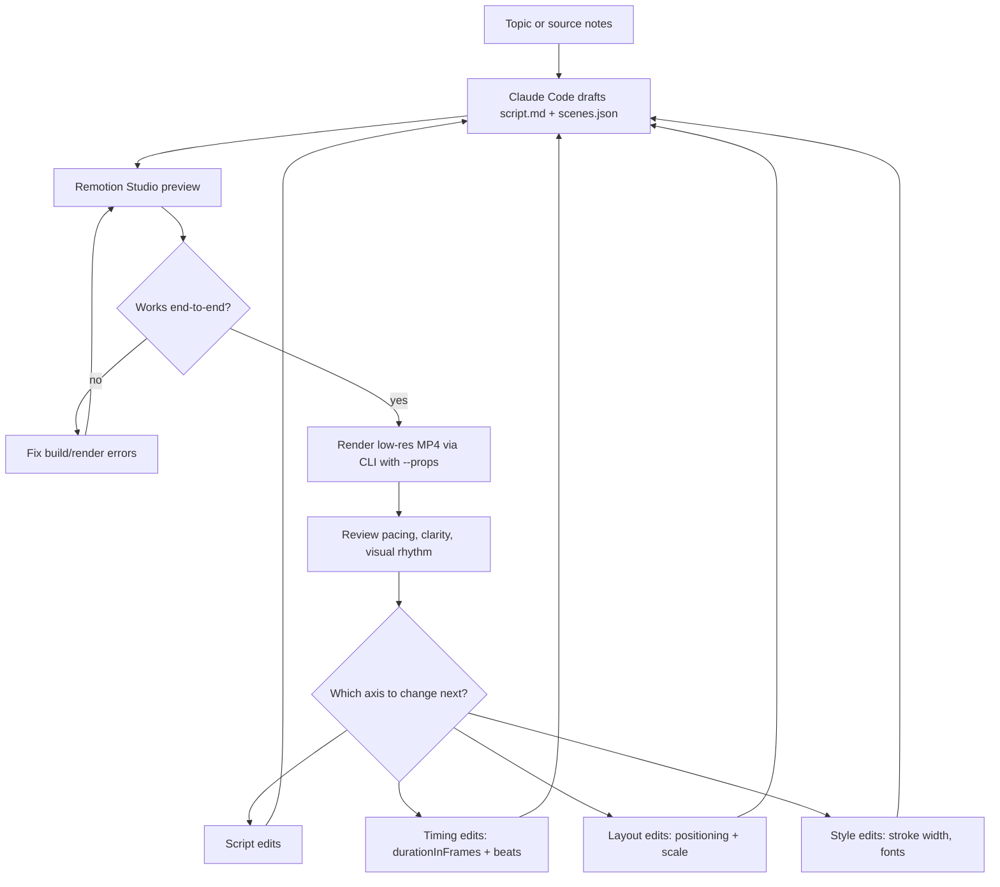
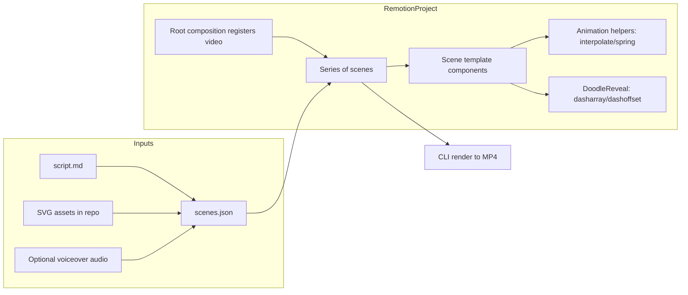

# Deep Research: Rapid-Prototyping AI Doodle and Whiteboard Explainer Videos with Claude Code and Remotion

## Executive summary

This report focuses on building **AI Doodle / Whiteboard Doodle / 2D “puppet-style” explainer videos** with a workflow optimized for **near-zero-shot first prototypes** and **fast iteration**, using **Claude Code + Remotion** as the primary build loop. The recommended strategy is to start with a **minimal, deterministic “scene grammar”** (a small set of reusable scene templates + a single animation toolkit), then iterate by editing structured input data (script + scene manifest + asset placements) rather than repeatedly rewriting animation code. This architecture matches how Remotion is designed: you render a React component over time using frame-driven animation primitives like `useCurrentFrame()`, `interpolate()`, and `spring()`, and assemble the video from multiple timed segments using `<Sequence>` or `<Series>`. citeturn9search3turn1search6turn1search16turn0search0turn0search10

Key documented constraints that strongly influence a robust prototype loop:

- In Remotion, animations should be driven by frame time (`useCurrentFrame()`), and certain “webby” approaches (like CSS transitions) can cause render-time issues; Remotion explicitly warns to animate in a frame-driven way and to understand rendering fundamentals to avoid flicker. citeturn9search8turn1search0turn9search3  
- For images, Remotion recommends using `` (not native `` or CSS `background-image`) so frames don’t flicker due to asset loading; `staticFile()` is the primary pattern for local assets in `public/`. citeturn4search7turn4search3turn4search15turn4search24  
- Claude Code is explicitly built to read a codebase, edit files, run commands, and iterate in an “agentic loop” (gather context → take action → verify results), with permissions and sandboxing options to control automation. citeturn2search0turn2search7turn2search8turn2search2turn2search12

### Strong recommendation for version one

Build a “whiteboard-like” explainer prototype using:

- **Scene templates:** 5–7 reusable scene types (Title, Bullet Reveal, Diagram Build, Comparison, Timeline, Q/A, Outro). *(Implementation: `<Series>` scenes fed from JSON input props.)* citeturn1search16turn7search4turn7search1  
- **Asset style:** simple **SVG line drawings** (black stroke, round caps/joins, minimal shading), optionally with light “sketch” variation later. This aligns with common descriptions of whiteboard animation as quick line drawings with little/no shading. citeturn6search6turn6search21turn4search1turn4search2  
- **Primary motion grammar:** (a) stroke “draw-on” reveal for SVG, (b) simple text fades/slides, (c) camera-like pan/zoom on still scenes; postpone “hand-with-marker” and complex puppet rigging until version two. SVG draw-on can be implemented with the well-established `stroke-dasharray` / `stroke-dashoffset` technique. citeturn4search1turn4search2turn0search28turn4search0

### What is documented vs inference

Documented: Remotion’s scene assembly primitives (`<Composition>`, `<Sequence>`, `<Series>`), frame/time primitives (`useCurrentFrame()`, `useVideoConfig()`), animation primitives (`interpolate()`, `spring()`), input props/serialization constraints, and asset-loading best practices. citeturn1search3turn1search6turn1search16turn1search0turn1search12turn0search0turn0search10turn7search1turn7search4turn4search7turn4search3  
Documented: Claude Code’s core capabilities (agentic coding, permissions, subagents, skills, hooks). citeturn2search0turn2search8turn2search1turn2search4turn2search3  
Inference (based on common tooling behavior + stable techniques): the most reliable “AI doodle” path for rapid prototyping is **deterministic vector + structured scene data** first, then optional AI-generated assets once the pipeline is stable; also, that short, style-only “visual prompts” tend to work better than mixed content/style prompts in many systems (not a Remotion/Claude Code fact, but a general workflow inference). citeturn6search6turn4search1turn9search3

---

## Landscape and format taxonomy

This section corresponds to **Section 1 (Category map)** from your requested deliverables.

### Category map and practical distinctions

Whiteboard/doodle explainer formats look similar at a distance, but they differ sharply by **asset requirements** and **animation complexity**. Definitions below use external references for “whiteboard animation” and “cutout/collage puppet” concepts, then map them to implementation realities in Remotion. citeturn6search21turn6search6turn6search0turn1search16turn9search3

| Format family | What it looks like | Primary assets | Primary motion | Implementation difficulty in Remotion | Why it’s “AI-friendly” |
|---|---|---|---|---|---|
| Whiteboard doodle | Drawings appear as if drawn live on a white surface, often with narration | SVG line drawings or vector strokes | “Draw-on” reveal, label reveals | Medium (mostly due to draw-on) | Deterministic path animation + reusable scene templates citeturn6search6turn6search21turn4search1turn4search2 |
| AI doodle explainer | Similar to whiteboard but drawings may be AI-produced; can be sketchy, stylized | SVG/PNG line art; sometimes AI images | Pan/zoom + reveals | Low–Medium (depends on asset type) | AI can generate assets; code arranges timing and layout citeturn9search3turn4search7turn4search3 |
| 2D puppet / cutout explainer | Flat characters moved like puppets (digital cutout style) | Layered PNG/SVG parts per character | Transforms around pivots; pose swaps | Medium–High (rigging + lip sync if desired) | Reuse character rigs across many videos citeturn6search0turn6search7turn9search17 |
| Still-image narrative (Ken Burns-ish) | Still images with “camera” motion | PNG/JPG scenes | Pan/zoom, subtle parallax | Low | Asset generation can be offloaded to AI; easy to time citeturn9search3turn4search7 |
| SVG infographic explainer | Clean vector diagrams, icons, callouts | SVG icons/graphs | Wipes, reveals, count-ups | Low–Medium | Libraries + deterministic layouts scale well citeturn9search6turn4search7turn1search16 |
| Network/flow explainers | Node graphs, Sankey diagrams, bubble clusters | Data-driven SVG paths | Layout + reveal | High (layout math, stability) | D3 provides layouts but adds complexity citeturn5search5turn5search2turn0search2turn0search9 |

### What “whiteboard” implies for an implementation

Independent descriptions of whiteboard animation consistently emphasize: **simple pen-like drawings**, often **no shading**, unfolding in sync with narration. That implies you get the most “whiteboard feel” from: (1) line art assets, (2) draw-on reveals, and (3) staged accumulation of diagrams. citeturn6search6turn6search14turn6search21

In Remotion terms, that typically means:

- Represent art as **SVG path strokes**, because SVG has native stroke styling and can be animated with stroke dash attributes. citeturn4search1turn4search2turn0search28  
- Drive the reveal with frame-based animation (`useCurrentFrame()` + `interpolate()`), and compose discrete “beats” using `<Series>` / `<Sequence>`. citeturn1search0turn0search0turn1search16turn1search6

---

## Workflow designs and pipeline comparison

This section corresponds chiefly to **Section 2 (Workflow comparison)**, with the goal of selecting a pipeline that supports near-zero-shot prototyping and fast iteration.

### The four pipeline archetypes

Traditional whiteboard production advice (script → storyboard → production) is still directionally true, but for rapid prototyping you want those steps to become **machine-editable artifacts** (JSON/Markdown) instead of “one big blob.” Whiteboard production guides emphasize the value of structured planning; the key adaptation here is to make the plan executable by Remotion. citeturn6search14turn9search3turn7search4

#### Pipeline comparison table

| Pipeline | What you provide | What Claude Code generates | Strengths | Weaknesses | Best use |
|---|---|---|---|---|---|
| Script-first | A script (or outline) | Scene plan + code + placeholders | Predictable; easy to review | Requires you to write/own script | When you already know what you want to say citeturn2search7turn7search4turn1search16 |
| Source-first | Documents/notes | Script + scene plan + code | Scales from research | Harder to control tone/pacing | When you have references and want explainers fast citeturn2search7turn2search5 |
| Template-first | Choose a format theme | Fills templates from minimal prompts | Fastest prototype loop | Risk of repetitive/“samey” output | When speed > uniqueness; YouTube-style output citeturn1search16turn7search25 |
| Hybrid (recommended) | Topic + optional bullets + constraints | Draft script + scene manifest + code | Balances speed & control | Needs careful schema design | Ideal for iterative improvements (your “6+ iterations” model) citeturn7search4turn1search16turn2search7 |

**Recommendation (V1): Hybrid pipeline.** The reason is practical: it produces a runnable prototype quickly, and it gives you stable “handles” for iteration (edit script text, scene order, durations, or assets without rewriting core animation code). This aligns with Remotion’s input-props model (pass JSON props via `defaultProps` or CLI `--props`) and its composition/scene tooling. citeturn7search1turn7search4turn7search24turn1search16turn1search3

### The “scene manifest” is the iteration lever

Remotion explicitly supports parameterizing videos via **Input Props** and overriding defaults via CLI `--props` (inline JSON or a file). That makes “edit a JSON manifest → rerender” a native workflow. citeturn7search3turn7search4turn7search0turn1search1

Claude Code is well-suited to iterating on this because it can: (a) edit files, (b) run renders/tests, (c) verify outcomes, and (d) apply systematic improvements across iterations. citeturn2search7turn2search0turn2search5

---

## V1 prototype blueprint

This section covers **Section 3 (Simplest viable prototype)**, **Section 4 (Visual style recommendation)**, **Section 5 (Asset generation strategy)**, and **Section 6 (Animation grammar)**.

### Simplest viable prototype for near-zero-shot success

A minimal prototype should prove four things “end-to-end”:

1) a Remotion project runs and previews in Studio and renders via CLI, citeturn1search7turn1search1turn1search4  
2) multiple scenes can be sequenced predictably, citeturn1search16turn1search6  
3) SVG doodles can be revealed and positioned reliably, citeturn4search1turn4search2turn0search28  
4) iteration is easy via input props. citeturn7search4turn7search3

A good first project starting point is the Remotion **Blank** template, explicitly described as recommended if you “plan to write your code with AI.” citeturn7search17

### Recommended V1 visual styles ranked by implementation ease

Whiteboard animation is traditionally simple line drawings, suggesting that the easiest-first style is “clean stroke SVG” with minimal fills. citeturn6search6turn6search21turn4search1

| Rank | Style | What you implement | Why it’s easy | Biggest pitfalls |
|---|---|---|---|---|
| Easiest | Clean SVG line art | Hand-authored or AI-authored SVG paths; render inline | No extra libs; native web rendering | Needs consistent stroke widths; assets must be curated citeturn4search1turn9search3 |
| Very easy | Icon-and-callout explainer | SVG icons + labels + arrows | Huge reusable icon inventory; minimal motion required | Looks less “hand drawn” unless stylized citeturn3search2turn3search3turn9search6 |
| Medium | Sketchy vector feel | Add “hand-drawn” jitter via a library | Faster “whiteboard vibe” without drawing each asset | Adds dependency + debugging surface citeturn3search0turn3search4 |
| Medium–High | True draw-on replay | Path-by-path draw timing + optional “hand” cursor | Most authentic whiteboard effect | Requires path segmentation, path length, and careful timing citeturn4search0turn4search16turn4search1turn4search2 |
| Hard | 2D puppet rigs | Per-character parts, pivot points, lip sync | Reusable for series formats | Complex to design and keep consistent across assets citeturn6search0turn9search17 |
| Hardest | Network/Sankey explainers | Layout + reveal + stable rendering | Visually powerful | Layout math, collision stability, and debugging costs citeturn0search2turn5search5turn5search2 |

**Recommendation:** Start with **clean SVG line art + staged reveals** (V1), then move to “sketchy” styling (V2) if desired. This is a pragmatic choice: it minimizes dependencies while preserving the core “whiteboard” semantics of drawing unfolding over time. citeturn6search6turn9search3turn9search8

image_group{"layout":"carousel","aspect_ratio":"16:9","query":["whiteboard animation line drawing explainer","SVG stroke dasharray dashoffset draw animation example","Rough.js sketchy SVG example","D3 sankey diagram example"],"num_per_query":1}

### Asset strategy options and what is easiest for Claude Code

#### Asset strategy comparison table

| Strategy | What you store in repo | Tooling | Pros | Cons | V1 fit |
|---|---|---|---|---|---|
| Code-generated SVG primitives | TypeScript components that draw arrows, boxes, stick figures | No extra dependency | Deterministic; easy to animate; Claude Code can edit reliably | Limited variety unless you invest in primitives | Excellent citeturn9search3turn9search8turn2search0 |
| Curated SVG icon libraries | Icon imports (React SVG components) | Icon packages | Huge inventory; consistent styling; easy composition | Less “hand drawn” unless stylized | Great citeturn3search2turn3search3turn3search7 |
| “Sketchify” existing SVGs | Source SVG + conversion layer | Sketch library (example: Rough.js; svg2roughjs) | Hand-drawn vibe quickly | More moving pieces; render-time edge cases | Good V2 citeturn3search0turn3search8 |
| Excalidraw-authored assets | `.excalidraw` JSON + exported SVG/PNG | Export utilities | Very “doodle” look; human-editable | Export pipeline + element complexity | Viable V2 citeturn3search1turn3search37 |
| AI image generation (stills) | PNG/JPG frames | External models | High variety; fast ideation | Consistency and editability are hard | Not ideal for V1 citeturn5search20turn7search35 |

**V1 recommendation (assets):** Use **code-generated SVG doodles + a small, curated icon set**. This keeps the repo “self-contained,” makes iteration faster, and reduces failure modes tied to inconsistent AI-generated art. This is an inference-driven recommendation, but it is grounded in (a) how Remotion is designed to render arbitrary React visuals per frame, and (b) the practical reality that deterministic assets are easier to keep stable across repeated iterations. citeturn9search3turn9search6turn2search7

### Minimal animation grammar

A whiteboard explainer feels “right” when visuals **accumulate** and **reveal** in sync with narrative beats. Implementation-wise, you want a tiny grammar of motions that you can reuse everywhere.

#### Animation primitives that Remotion supports cleanly (documented)

- Frame-relative animation using `useCurrentFrame()` and composition metadata via `useVideoConfig()`. citeturn1search0turn1search12  
- Time/value mapping via `interpolate()` and spring motion via `spring()`. citeturn0search0turn0search10turn9search8  
- Scene sequencing via `<Sequence>` or `<Series>`. citeturn1search6turn1search16  

#### SVG draw-on technique (documented by web standards; implementation inference)

The widely documented technique is:

- set `stroke-dasharray` to a value that covers the path length, citeturn4search1turn4search20turn0search28  
- set `stroke-dashoffset` to the same value so the stroke is initially hidden, citeturn4search2turn0search28  
- animate dashoffset toward 0 over time.

For exact dash lengths, `SVGPathElement.getTotalLength()` returns computed path length; this can be used to set correct dash values. citeturn4search0turn4search12turn4search16

#### V1 grammar vs V2 grammar table

| Motion type | V1 inclusion | V2 inclusion | Rationale |
|---|---:|---:|---|
| Text fade/slide | Yes | Yes | Low risk; use `interpolate()` citeturn0search0turn9search8 |
| SVG draw-on reveal | Yes (simple) | Yes (precise) | Core “whiteboard” feel; refine later with real path lengths citeturn4search1turn4search2turn4search0 |
| Staggered diagram build | Yes | Yes | Great for pacing; easy with `<Series>` citeturn1search16 |
| Pan/zoom on board | Yes (basic) | Yes (better easing) | Helps visual dynamism without new assets citeturn9search17turn0search0 |
| “Hand drawing” cursor | No | Optional | Requires path sampling (`getPointAtLength`) and synchronization citeturn4search16turn4search0 |
| Puppet character with lip sync | No | Optional | Quickly becomes a “character system” project citeturn6search0turn9search17 |
| Force-directed node layouts | No | Optional | Layout can dominate scope; D3-force exists but adds complexity citeturn5search5turn5search2 |

### A concrete V1 specification

This is the **V1 blueprint** requested in your deliverables.

**Composition baseline (editable later):** 1920×1080, 30fps. *(These are common defaults; Remotion examples frequently reference these values via `useVideoConfig()`. If you want 4K later, Remotion supports output scaling via CLI `--scale`.)* citeturn1search12turn9search0

**Inputs (single source of truth):**

- `script.md` (human-readable narrative)
- `scenes.json` (machine-readable manifest; passed via Input Props) citeturn7search4turn7search3
- `assets/` as SVG components or static SVG files in `public/` accessed via `staticFile()` citeturn4search3turn9search3

**Scene types (minimum set):**

- TitleScene
- ProblemScene (single diagram + label)
- StepRevealScene (3–5 bullets)
- DiagramBuildScene (3–8 doodles appearing sequentially)
- CompareScene (two columns)
- OutroScene

**Animation grammar (V1):**

- Text: fade + slight translate-in (10–15 frames)
- Doodles: draw-on reveal (simple dash animation) or wipe-reveal fallback
- Staging: composition assembled with `<Series>`; each scene gets its own durationInFrames citeturn1search16turn0search0turn4search1turn4search2

**Rendering:**

- Preview using Remotion Studio; render using `npx remotion render …` and update using `--props=./scenes.json`. citeturn1search7turn1search1turn7search4

---

## Agentic workflow with Claude Code and iteration loop

This section covers **Section 7 (Role of AI agents)** and **Section 8 (Iteration model)**.

### What Claude Code can realistically do well

Claude Code is described as an **agentic coding tool** that reads a codebase, edits files, and runs commands; it operates in an iterative “agentic loop.” citeturn2search0turn2search7

It also supports:

- built-in subagents (Explore, Plan, General-purpose) to split work, citeturn2search1  
- skills (instructions/workflows stored in repo), citeturn2search4turn7search10  
- hooks to run deterministic actions at lifecycle events (like linting after edits), citeturn2search3turn2search9  
- permissions and sandboxing controls. citeturn2search8turn2search2turn2search12  

#### Strength assessment by task (practical)

| Task | Claude Code fit | Why | Guardrails |
|---|---|---|---|
| Project scaffolding + wiring scenes | Strong | Deterministic file edits + known Remotion primitives citeturn7search17turn1search16turn2search0 | Use Remotion Agent Skills to enforce best practices citeturn7search10turn4search24 |
| Implementing animation helpers | Strong | `useCurrentFrame()` + `interpolate()` patterns are straightforward citeturn1search0turn0search0turn9search8 | Avoid CSS transitions; frame-driven only citeturn9search8 |
| SVG draw-on component | Usable with guardrails | Technique is standard, but path-length edge cases exist citeturn4search0turn4search1turn4search2 | Start with “large dash constant”; add `getTotalLength()` in V2 |
| Script drafting | Usable with guardrails | Language models draft scripts quickly (inference) | Require outline + constraints; keep scene-per-paragraph mapping explicit citeturn2search7 |
| Asset generation (icons / primitives) | Strong | SVG/React components are easy to create programmatically citeturn9search6turn9search3 | Keep palette + stroke style consistent |
| Asset generation (AI images) | Medium | External consistency issues; pipeline complexity (inference) | Use a separate, optional step; don’t block V1 on it |
| Full autonomous “zero-edit final video” | Weak as a goal | Even Claude Code docs emphasize permissions + verification loops; automation needs review citeturn2search8turn2search7 | Treat V1 as prototype by design |

### Installing guidance that improves Claude Code’s Remotion output

Remotion maintains **Agent Skills** intended for AI agents (explicitly naming Claude Code) and provides an install command. citeturn7search10

A practical recommendation is to install these skills into the Remotion project so Claude Code is more likely to follow Remotion-specific best practices (like the `` requirement for non-flickering images). citeturn4search24turn4search7turn7search10

### Iteration loop that matches your “6+ iterations” style

Claude Code’s “gather context → take action → verify results” model pairs naturally with a loop where each iteration produces a render artifact you can judge. citeturn2search7turn2search5

#### Recommended iteration loop (operational)

- Iteration outputs: (a) preview in Studio, (b) low-res render, (c) updated `scenes.json`, (d) a short changelog note.
- Iteration focus: change one axis at a time (script wording vs timing vs layout vs art style).
- Use hooks to run lint/typecheck automatically after Claude Code edits, reducing “death by a thousand small regressions.” Hooks are explicitly positioned as deterministic automation rather than “hoping the model does it.” citeturn2search9turn2search3turn2search14

This loop relies on Remotion’s CLI render and props system (documented) and Claude Code’s ability to run commands and iterate (documented). citeturn1search1turn7search4turn2search0turn2search7

---

## Architecture, Remotion fit, and reusable system design

This section covers **Section 9 (Remotion fit)** and **Section 10 (Reusable system design)**, with a bias toward “as simple as works” and scaling up only after V1 is stable.

### Why Remotion is a strong fit for doodle explainers

Remotion’s fundamentals state it provides a frame number and a blank canvas, and you render with React. That is exactly what you need for deterministic “draw-on” and staged reveal scenes. citeturn9search3turn1search0

Remotion’s core API list and docs emphasize composition and sequencing primitives plus animation primitives; this supports a clean “scene template library” model. citeturn1search15turn1search16turn1search6

Remotion also provides:

- local and cloud render options (`npx remotion render`, Lambda, etc.), citeturn1search1turn1search13  
- parameterization via input props, citeturn7search3turn7search4  
- Lottie integration (`@remotion/lottie`) if you later want “hand-animated” vector assets without building them from scratch. citeturn1search2turn1search8turn1search34

### Core architecture for a rapid-prototyping doodle system

The best architecture for iteration is: **thin code + thick data**.

- Code should define stable scene templates and animation helpers.
- Data should define per-video story content, pacing, and placements.

This aligns with the fact that `defaultProps` and CLI `--props` expect JSON-serializable values, encouraging a clean schema. citeturn7search1turn7search4turn7search24

Composition registration and sequential scene stitching are explicitly described in Remotion docs (`<Composition>`, `<Series>`, `<Sequence>`), as is the idea of default props and JSON-serializability. citeturn1search3turn1search16turn1search6turn7search1

### Reusable system design roadmap

Remotion itself offers a “Prompt to Video” template that generates script, images, voiceover, and timeline (using external AI services). That template demonstrates the viability of a multi-stage “generate assets + timeline → render” pipeline even if you don’t adopt the same providers. citeturn7search35turn7search21

A staged roadmap that matches your iteration expectations:

- **Stage one:** V1 scene templates + doodle reveal + JSON manifest.
- **Stage two:** add a CLI step to generate `scenes.json` from a “topic prompt” (script-first or source-first).
- **Stage three:** add optional asset generation modules (icons → sketchify; or AI stills) only after stability.
- **Stage four:** add a “puppet narrator” system if you’re committed to character-driven series.

This roadmap is an inference, but it is grounded in (a) Remotion’s support for templates and parametric rendering and (b) the existence of an official prompt-to-video template showing multi-stage generation patterns. citeturn7search35turn7search4turn1search16

### Notes on licensing as a practical constraint

Remotion’s license docs state it is free for individuals and certain small organizations and requires a company license otherwise. If you later productize or scale this pipeline in an organization, this becomes a real implementation constraint. citeturn8search0turn8search2turn8search6

---

## Risks, constraints, and final recommendation

This section covers **Section 11 (Constraints and failure points)** and **Section 12 (Practical recommendation)**, and includes the final deliverables: V1 blueprint summary and a short Claude Code handoff prompt.

### Constraints and failure points

#### Visual inconsistency

If you rely heavily on AI-generated assets (stills), it’s difficult to keep consistent characters and line style without additional control mechanisms; diffusion research such as ControlNet addresses conditioning and controllability for text-to-image models, but that adds pipeline weight and is not automatically “simple.” citeturn5search20turn5search31turn5search16  
**Mitigation:** in V1, use deterministic SVG assets and only introduce AI-generated stills when your template system is stable (inference grounded in pipeline complexity). citeturn9search3turn7search4

#### Timing brittleness

If each scene’s timings are hand-tuned in code without a schema, iteration becomes slow. Remotion’s `<Sequence>`/`<Series>` and input props systems are designed precisely to make timing data-driven. citeturn1search6turn1search16turn7search3  
**Mitigation:** store time in frames in `scenes.json`, and keep “timing math” centralized.

#### Render flicker and asset loading

Remotion documents that using CSS background images can cause flickering because Remotion can’t know when the image is loaded; it recommends `` for reliable rendering. citeturn4search15turn4search7turn4search24  
**Mitigation:** enforce `` + `staticFile()` for raster assets. citeturn4search3turn4search7turn4search24

#### SVG draw-on edge cases

The dasharray/dashoffset reveal is reliable, but “perfect” draw-on requires knowing each path length; `getTotalLength()` returns the computed value, but integrating dynamic measurement into a render pipeline adds complexity. citeturn4search0turn4search12turn4search1turn4search2  
**Mitigation (V1):** use a large constant dash value and accept imperfect proportionality; **Mitigation (V2):** compute per-path lengths (and optionally track a “hand cursor” using `getPointAtLength()`). citeturn4search16turn4search0

#### Claude Code automation risks

Claude Code uses permissions by default and requires explicit approval for actions like file edits and bash commands unless you configure policies/sandboxing; this is a safety feature but can slow iteration if not configured. citeturn2search8turn2search2turn2search14  
**Mitigation:** create a project-level permissions policy and use sandboxing for safe automation, then add hooks for deterministic lint/test steps. citeturn2search12turn2search9turn2search3

### Final practical recommendation

**Start with a reusable “whiteboard scene kit” (V1)** that uses:

- `<Series>` for scene sequencing, and a typed `scenes.json` manifest passed as input props. citeturn1search16turn7search4turn7search1  
- Clean SVG line art doodles (simple strokes, no shading) with draw-on reveal via dasharray/dashoffset. citeturn6search6turn4search1turn4search2turn0search28  
- Strict asset-loading rules (``, `staticFile()`) to avoid flicker. citeturn4search7turn4search3turn4search15  
- Claude Code + Remotion Agent Skills to reduce mistakes and enforce best practices. citeturn7search10turn2search4turn2search0  

Then iterate:

- First iterations: correctness and stability (the video renders, scene order is correct).
- Next: pacing and clarity (beat timing, text density).
- Last: aesthetic upgrades (sketch style, hand cursor, puppet narrator).

This order is an inference, but it is consistent with documented Remotion constraints (frame-driven animation, asset handling) and Claude Code’s iterative development workflow model. citeturn9search8turn4search7turn2search7

---

## Recommended V1 blueprint

**Goal:** A 60–120 second explainer video that can be generated from a single `scenes.json` file and a small set of SVG doodle components.

**Repository structure (suggested):**

- `src/Root.tsx` registers one composition that takes `{scenes: Scene[]}`  
- `src/scenes/*` contains the 5–7 scene templates  
- `src/components/DoodleReveal.tsx` draw-on helper  
- `src/components/CalloutText.tsx` text helper  
- `src/assets/doodles/*` small SVG doodle components *(or static SVGs in `public/`)*  
- `scenes.json` in project root, passed via CLI `--props=./scenes.json`  

This uses documented Remotion primitives: `<Composition>`, `<Series>`, input props, CLI render. citeturn1search3turn1search16turn7search4turn1search1

**Scene schema (minimum):**

- `id`, `type`, `durationInFrames`
- `title`, `body` (array of strings)
- `doodles` (asset key + x/y + scale + reveal timing)

**Animation grammar rules:**

- All motion driven by `useCurrentFrame()` + `interpolate()`/`spring()` (no CSS transitions). citeturn1search0turn0search0turn0search10turn9search8  
- Doodle draw-on reveal from frame `start` to `end` using dashoffset. citeturn4search1turn4search2turn0search28  

**Tooling:**

- Development: Remotion Studio preview, then CLI render. citeturn1search7turn1search1  
- Claude Code: install Remotion Agent Skills, optionally add hooks to auto-run `npm test` / `npm run lint` (or `tsc`). citeturn7search10turn2search9turn2search3  

---

## Claude Code handoff prompt

Use this prompt as a short, direct handoff to Claude Code to implement V1:

Create a Remotion TypeScript project (use the Blank template) that renders a whiteboard-style explainer video from a JSON scene manifest passed via Remotion input props (`--props=./scenes.json`). Implement a small scene system using `<Series>` where each scene template supports: title text, bullet reveals, and placement of simple SVG “doodle” assets. Add a reusable `DoodleReveal` component that animates SVG strokes using `stroke-dasharray` / `stroke-dashoffset` driven by `useCurrentFrame()` + `interpolate()` (no CSS transitions), with per-doodle stagger support. Enforce Remotion rendering best practices: use `` + `staticFile()` for any raster assets, keep props JSON-serializable, and include an example `scenes.example.json` plus a `render` npm script that runs `npx remotion render … --props=./scenes.example.json out.mp4`.

This prompt is aligned to documented Remotion APIs (Series/Sequence, input props, interpolate, and asset rules) and Claude Code’s ability to edit files and run commands. citeturn1search16turn7search4turn0search0turn1search0turn4search24turn2search0